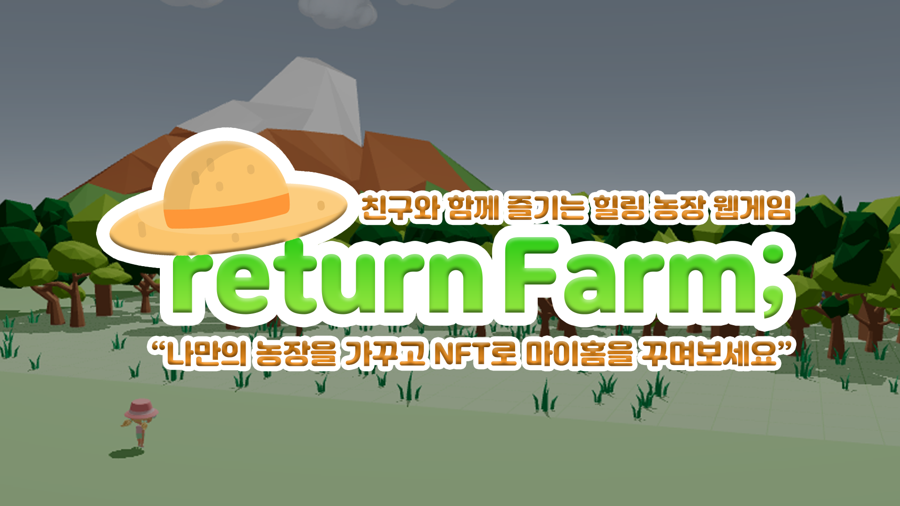
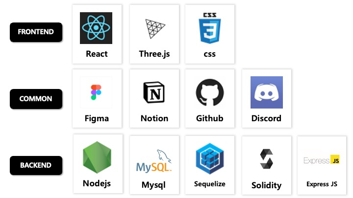

## “**나만의 농장을 가꾸고 NFT로 마이홈을 꾸며보세요.”**

*친구와 함께 웹에서 즐기는 힐링 농장 게임, **리턴팜**.*  

> **리턴팜 비전**
> 
- 기존 P2E의 이미지(수익성)를 탈피하여 게임성에 중점을 둔 게임
- 중장기적으로 안정적인 시세를 가지는 토큰 이코노미 구성
- 국내 게임 유저들을 블록체인에 유입시키는 것
- 주로 수집 용도로 사용되는 NFT의 적극적인 활용  
#
> **리턴팜 백서**
> 

[returnFarm_whitePaper.pdf](README/1205_returnFarm_whitePaper_v1.pdf)
#
> **기술 스택**
> 



## How To Play  ****

> git clone
> 

```
# Clone this repository
$ git clone git@github.com:codestates-beb/BEB-06-returnFarm.git
```

> .env setting
> 

```
## sercurity

ACCESS_SECRET=
REFRESH_SECRET=

## mySQL

MYSQL_USERNAME=""
MYSQL_PASSWORD=""
MYSQL_DATABASE=""
MYSQL_HOST=""

NODE_ENV=
SERVER_PORT = ""

PRIVATEKEY = ""
```

> Client
> 

```
$ npm install 
$ npm start
```

> Server
> 

```jsx
$ npm install
$ npm start
```

## 게임 플레이

> **농사**
> 
- 토큰으로 농사에 필요한 씨앗을 구매하여, 작물을 키움
- 키운 작물은 거래소에 판매하여 햇살 토큰 획득
- 획득한 토큰으로 점점 농장을 키워나갈 수 있음
- 심은 뒤에도 꾸준한 접속 및 관리가 있어야 좋은 등급의 작물을 수확할 수 있음

> **마이홈 꾸미기(NFT)**
> 
- 마이홈 꾸미기
    - NFT로 꾸미는 세상에 단 하나 뿐인 나만의 집
- NFT 생성 플랫폼
    - 3D 이미지를 업로드 하면, NFT로 바꿔줌
    - 내가 생성한(3D→NFT) NFT는 유저들 간에 매매할 수 있음 → 잎 토큰을 획득하여 수익 창출

> **낚시터 (Advanced)**
> 
- 낚시 1회  - 1시간동안 낚시할 수 있음, 10햇살
- 낚을 수 있는 것(확률을 다르게 부여)
    - 햇살, 비료, NFT 화이트 리스트
    - 꽝 - 물고기 49%

## 토큰 이코노미

> **햇살 토큰, 잎 토큰**
> 


: 리턴팜은 햇살 토큰과 잎 토큰으로 토큰 이코노미를 구성한다. 햇살 토큰과 잎 토큰은 상호 보완적인 토큰으로 일정 비율로 교환이 가능하다. 햇살(Haessal) 토큰은 ‘해에서 나오는 빛의 줄기’라는 뜻의 ‘햇살’의 의미를 가지고 있고, 잎(IP) 토큰은 식물에서 광합성을 비롯한 다양한 생명 활동을 하는 기관인 ‘잎'으로 이름 지었다. 햇살 토큰은 NFT 활동을 제외한 게임 속에서 이루어지는 모든 거래 수단으로 사용된다. 잎 토큰은 NFT 민팅과 거래에 사용된다. 유저는 햇살 토큰을 통해 안정적인 수익을 얻을 수 있고 잎 토큰으로 교환을 해 NFT를 거래하거나 암호화폐 거래소에서 사고 팔기가 가능하다.

> **토큰 배분**
> 


## 관련 기술

> ERC20
> 

: 리턴팜은 3D 창작물은 민팅 할 수 있는 플랫폼을 제공한다. openzeppline의 라이브러리를 사용하여 ERC721 컨트랙트를 상속 민팅된 토큰은 NFT(Non-Fungible Token)으로 대체 불가능하고 고유의 tokenId를 부여받는다. 리턴팜의 ERC721 컨트랙트는 ERC20(잎 토큰)을 사용하여 거래가 가능하게 설정한다(setToken). 유저는 NFT를 마켓에 등록할 수 있고, 전송 권한을 부여 받은 서버계정은 구매자에게 구매 가격을 잎 토큰으로 받고 NFT를 보내준다. 또한 유저간에 직접 NFT를 전송하고 받아 볼 수 있다.

> ERC721
> 

: 리턴팜의 기본 재화 중 하나인 잎 토큰은 ERC20 토큰으로 대체 가능한(fungible) 토큰이다. openzeppline 라이브러리의 ERC20 컨트랙트를 상속받아 배포됐다. ERC 토큰을 사용해 NFT 민팅 거래 수수료를 지급할 수 있으며 NFT마켓에 등록된 3D 파일을 구매할 수 있다.

> web3.js
> 

: 리턴팜에서 배포한 두 개의 컨트랙트를 JS에서 사용할 수 있게 하는 라이브러리이다. JS에서 배포된 컨트랙트의 함수들을 이용하여 트렌젝션을 발생시켜 유저 간에 거래를 자동화 할 수 있다

## 커뮤니티

- 게시판을 활용한 유저 간 소통 활성화
- 채팅을 통한 유저 간 소통 활성화
- 게시판 / 맵을 통해서 친구집으로 이동
- 게임 커뮤니티 안에서 자신이 원하는 디자인의 NFT 제작 요청 혹은 판매

## 팀

| 이름 | 역할 | 소감 |
| :---: | :---: | --- |
| 곽규명(팀장) |  |  |
| 강석민 | 스마트컨트랙트, 거래 API 제작, 토큰이코노미 구성 | 좋은 팀원들과 함께한 멋진 프로젝트! 리턴팜으로 힐링과 재미 그리고 수익까지 모두 챙겨가세요~! |
| 김륜하 | 백(서버) | 토큰 이코노미 구성 막상 게임을 할 때는 몰랐는데, 로그인 하나에도 많은 코드와 작업이 필요하다는 것을 느꼈다. 크립토 이코노미를 구상하면서, 그 어떤 경영 게임보다도 진지하게 많은 상황과 가정을 생각하며 토큰 이코노미를 팀원들과 만들었다. 리턴팜을 만드는 것이 나에게는 작은 세계를 하나를 만드는 것 같이 느껴졌다. 배포가 된다면, 다른 사람들에게도 재미있고 힐링이 되는 게임이 되었으면 좋겠다. |
| 정은경 | 데이터베이스 | 오래전부터 생산자와 소비자를 연결하는 부분에 대해서 고민을 해왔었는데 블록체인을 기반으로 한 P2E 게임으로 구현할 수 있어 즐거웠습니다. 개발이라는 과정 속에 다양한 방면을 고려하여 설정해야 하는 부분들과 토크노믹스까지 폭넓게 생각해 볼 수 있는 멋진 프로젝트였습니다. 우리 팀원들과 함께하지 않았다면 리턴팜이라는 게임은 탄생하지 못했을 거예요! 함께할 수 있어 매우 기쁘게 생각합니다! |